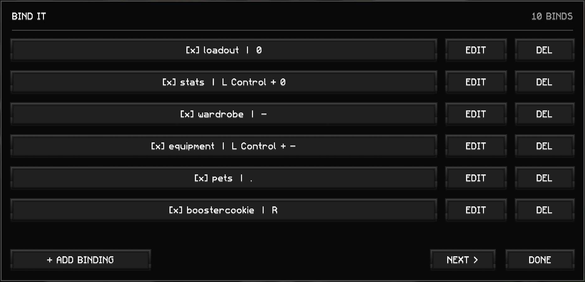

# Bind It



A client-side Fabric mod for Minecraft 26.1.2 that binds single keys or key combinations to chat messages and commands.

## Features
- Open the terminal-style manager with `/bindit` or Mod Menu's config button.
- Add, edit, enable/disable, and remove bindings.
- Capture multi-key shortcuts; press the keys in sequence and finish with Enter.
- Actions beginning with `/` are commands; all other actions are chat messages.
- Bindings persist in `.minecraft/config/bindit.json`.
- Fully keyboard-navigable through Minecraft's standard Tab/Shift+Tab, Enter, and Escape controls.

## Build
Minecraft 26.1.2 requires Java 25.

```bash
JAVA_HOME=/path/to/java-25 ./gradlew build
```

The distributable jar is written to `build/libs/`.

## Runtime dependencies
- Fabric Loader 0.19.3+
- Fabric API for Minecraft 26.1.2
- Mod Menu is optional and supported when installed.
